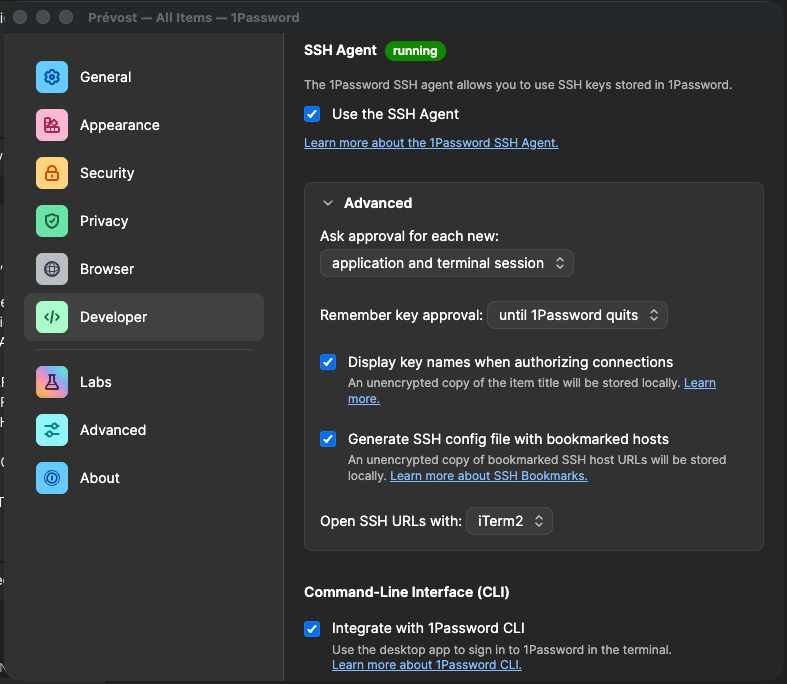

# Dotfiles

Personal macOS dotfiles managed with [chezmoi](https://www.chezmoi.io/).

## Purpose

This repository centralizes the configuration of a macOS development environment. It automates the setup of a new machine from scratch: shell, tools, applications, macOS system preferences, Git repositories, and Dock layout. The goal is to be able to reproduce a fully operational environment with minimal manual steps.

---

## Repository Structure

### `scripts/`

Standalone scripts meant to be run manually, outside of chezmoi.

- **`mac-setup.sh`** — Bootstrap script for setting up a brand new machine. Installs Homebrew, sets up SSH, installs all applications and CLI tools from the Brewfile, and initializes chezmoi. Run this first on a fresh machine.

### `.chezmoidata/`

YAML data files that feed chezmoi templates. Centralizes configuration data so scripts and templates stay logic-only.

- **`git.yaml`** — Defines the root directory for repositories and the list of repositories to clone, organized by category.
- **`dock.yaml`** — Defines the list of applications to pin to the macOS Dock.

### `.chezmoiscripts/`

Scripts automatically executed by chezmoi on `chezmoi apply`.

- **`run_once_before_01-setup-zsh.sh`** — Installs Zsh if not already present.
- **`run_once_before_02-setup-oh-my-zsh.sh`** — Installs Oh My Zsh if not already present.
- **`run_once_osx-*.sh`** — One-time scripts that apply macOS system preferences (Finder, keyboard, trackpad, display, Dock, Mission Control, security, screenshots, desktop, hot corners, Safari, Mail, Activity Monitor, TextEdit, Control Center, printing, Terminal, software update).
- **`run_osx-99-always-macosx-restart-processes-if-required.sh`** — Always runs on apply to restart macOS processes that may need it after preference changes.
- **`run_onchange_clone-repositories.rb.tmpl`** — Clones Git repositories defined in `.chezmoidata/git.yaml`. Re-runs automatically whenever `git.yaml` changes.
- **`run_onchange_dockitems-dock.sh.tmpl`** — Configures the macOS Dock using `dockutil` based on `.chezmoidata/dock.yaml`. Re-runs automatically whenever `dock.yaml` changes.

### `.chezmoiexternal.toml`

Declares external resources that chezmoi fetches and manages automatically:

- **Oh My Zsh plugins** — `zsh-autosuggestions`, `zsh-syntax-highlighting` (refreshed weekly).
- **Oh My Zsh theme** — `powerlevel10k` (refreshed weekly).
- **Fonts** — Powerlevel10k fonts and Source Code Pro, installed directly into `~/Library/Fonts`.

### `dot_homebrew/Brewfile`

Declares all CLI tools and macOS applications to install via Homebrew. Managed by `brew bundle`.

### Other dotfiles

| File | Target | Description |
|---|---|---|
| `dot_zshrc` | `~/.zshrc` | Zsh configuration |
| `dot_p10k.zsh` | `~/.p10k.zsh` | Powerlevel10k prompt configuration |
| `dot_gitconfig` | `~/.gitconfig` | Git global configuration |
| `dot_gitignore` | `~/.gitignore` | Git global ignore rules |
| `dot_vimrc` | `~/.vimrc` | Vim configuration |
| `dot_ackrc` | `~/.ackrc` | ack search tool configuration |
| `dot_ssh/` | `~/.ssh/` | SSH configuration |
| `dot_config/` | `~/.config/` | XDG config directory |
| `dot_m2/` | `~/.m2/` | Maven configuration |
| `dot_gitconf/` | `~/.gitconf/` | Additional Git configuration |
| `dot_media-archiver/` | `~/.media-archiver/` | Media archiver configuration |
| `private_dot_npmrc.tmpl` | `~/.npmrc` | npm configuration (private, templated) |
| `private_Library/` | `~/Library/` | macOS Library files (private) |

---

## How to Add a CLI Tool or Application

To find the correct formula or cask name: `brew search "tool-name"`.

### From Scratch (during initial machine setup)

At this stage chezmoi is not yet applied, so edit the Brewfile directly and let the bootstrap script handle the installation.

1. Open `dot_homebrew/Brewfile` in this repository.
2. Add a `brew "tool-name"` line (CLI tool) or a `cask "app-name"` line (macOS application).
3. The `mac-setup.sh` bootstrap script will install everything from the Brewfile when it runs.

### Day-to-Day (chezmoi already applied)

Use chezmoi to edit the Brewfile so changes are tracked, then install immediately.

**CLI tool:**
```sh
chezmoi edit ~/.homebrew/Brewfile  # add: brew "tool-name"
brew tool-name
chezmoi apply
```

**macOS application:**
```sh
chezmoi edit ~/.homebrew/Brewfile  # add: cask "app-name"
brew --cask app-name
chezmoi apply
```

### Pin an application to the Dock

1. Open `.chezmoidata/dock.yaml`.
2. Add the full application path under `dock.apps`:
   ```yaml
   dock:
     apps:
       - /Applications/MyApp.app
   ```
3. Run `chezmoi apply` — the Dock script will re-run automatically since the file has changed.

---

## Runtime Tool Management (mise)

Language runtimes and development tools (Java, Node.js, Python, Maven, Terraform, Terragrunt, etc.) are managed by [mise](https://mise.jdx.dev/), not Homebrew.

Global versions are defined in `dot_config/mise/config.toml`, which maps to `~/.config/mise/config.toml` and is tracked by chezmoi:

```toml
[tools]
java = "temurin"
maven = "latest"
node = "latest"
python = "latest"
terraform = "latest"
terragrunt = "latest"
```

### Adding or changing a tool version

```sh
chezmoi edit ~/.config/mise/config.toml  # add or update the tool entry
mise install                              # install the new version(s)
chezmoi apply
```

To find available versions for a tool: `mise ls-remote <tool>`.

### Per-project overrides

Versions can be overridden per project by adding a `.mise.toml` (or `.tool-versions`) file at the root of the project. These files are not managed by this repository.

---

## How to Add a Git Repository to Auto-Clone

1. Open `.chezmoidata/git.yaml`.
2. Add the repository under the appropriate category (or create a new one):
   ```yaml
   git:
     root: ~/Documents/repositories
     repositories:
       my-category:
         - name: my-repo
           url: git@github.com:username/my-repo.git
   ```
3. Run `chezmoi apply` — the clone script will re-run automatically since the file has changed.

Repositories are cloned into `<root>/<category>/<name>`. Already existing directories are skipped.

---

## Setting Up a New Machine from Scratch

### 1. Install Xcode Command Line Tools

```sh
xcode-select --install
```

### 2. Clone this repository

Clone over HTTPS into `/tmp` (SSH key is not yet set up at this point, and the directory will be cleaned up automatically on next restart):

```sh
git clone https://github.com/<your-username>/<this-repo>.git /tmp/chezmoi
```

> **GitHub EMU (Enterprise Managed Users)**
>
> If your GitHub account is managed by your organization (SSO/Azure AD), you cannot use personal credentials or GitHub Credential Manager before they are installed. Use a Personal Access Token (PAT) instead:
>
> 1. Go to **GitHub → Settings → Developer settings → Personal access tokens → Tokens (classic)**.
> 2. Generate a new token with the `repo` scope.
> 3. If your organization enforces SSO, click **Configure SSO** next to the token and authorize it for your organization.
> 4. Clone using the token directly in the URL:
>    ```sh
>    git clone https://<your-username>:<your-pat>@github.com/<your-username>/<this-repo>.git /tmp/chezmoi
>    ```
>    The token is only needed for this initial clone. Once the bootstrap script has run and GitHub Credential Manager is installed, subsequent Git operations will use it instead.

### 3. Run the bootstrap script

```sh
/tmp/chezmoi/scripts/mac-setup.sh
```

This will:
- Install Homebrew
- Set up the `~/.ssh` directory and generate an SSH key
- Pause and ask you to add the public key to your GitHub account
- Create `~/Documents/repositories`
- Install all CLI tools and applications from the Brewfile
- Pause and ask you to set up 1Password
- Initialize chezmoi with your dotfiles repository

### 4. Set up 1Password

When the script pauses for 1Password, complete the following steps **before** pressing Enter. The SSH agent config has already been copied by the script so that 1Password can pick it up immediately.

#### Sign in and set up vaults

1. Open 1Password and sign in to your account.
2. Make sure your vaults are accessible.

#### Configure Developer settings

Go to **1Password → Settings → Developer** and configure exactly as shown below:



| Setting | Value |
|---|---|
| Use the SSH Agent | ✅ enabled |
| Ask approval for each new | `application and terminal session` |
| Remember key approval | `until 1Password quits` |
| Display key names when authorizing connections | ✅ enabled |
| Generate SSH config file with bookmarked hosts | ✅ enabled |
| Integrate with 1Password CLI | ✅ enabled |

#### Restart 1Password

After saving the Developer settings, **restart 1Password** so it reloads the SSH agent config that was copied by the script. Without this restart, the vault defined in `agent.toml` will not be taken into account.

Once 1Password is back up and the SSH agent shows as **running**, press Enter in the terminal to continue.

#### Create the machine vault and import the SSH key

**Why this is necessary:** the `agent.toml` config points the 1Password SSH agent to a vault named after the machine hostname. For the SSH agent to serve the key to Git and GitHub, the vault must exist and the SSH key must be stored in it. Without this, `chezmoi init` and all subsequent SSH operations will fail.

The setup script handles this automatically via the `op` CLI:
- Signs in to 1Password CLI (`op signin`)
- Creates a vault named `<hostname>` if it does not already exist
- Imports `~/.ssh/id_rsa` as an SSH Key entry titled `<username> - <hostname> - ED25519`

**Manual fallback** (if the automated step fails):

1. Open 1Password and create a new vault named after your machine hostname:
   ```sh
   hostname  # to get the exact name to use
   ```
2. In the new vault, create a new item: **New Item → SSH Key**.
3. Title it exactly: `<username> - <hostname> - ED25519`
4. In the **Private Key** field, import `~/.ssh/id_rsa`.
5. Save the item.

### 5. Apply dotfiles with chezmoi

If chezmoi was not initialized automatically by the script:

```sh
chezmoi init --apply git@github.com:<your-username>/<this-repo>.git
```

This will apply all dotfiles, run macOS preference scripts, clone your Git repositories, and configure your Dock.

### 6. Restart

Restart your machine to ensure all macOS preferences are fully applied.
